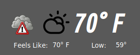
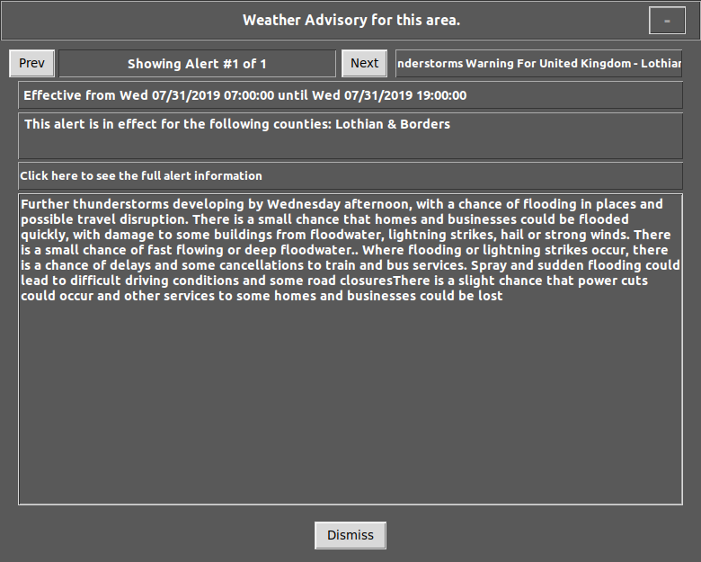

# _weathernow_
### _Version 0.2_
weather demonstration program in Python/Tkinter and Page


Required libraries:

*    requests
*    geopy


NOTE:

*_ You MUST obtain your own API key for the DarkSky Weather API.  I will not provide my key to you and the program will not run without a valid API key.  One can be obtained by going to https://darksky.net/dev/register and entering the required information.  You will be sent an email to verify your information.  Once you have accomplished this, you will be given your secret API key.  Keep this secret.  The account that you get will allow for up to 1000 API calls per day for free.  After that, they will charge you per call (at a very small rate).  The 1000 calls per day should be sufficient for any normal development and daily use._*


The reason I wrote this program was to prove that Python and Tkinter can produce programs that do not look like something out of the 1990s.

This code has been tested under Python 3.6.8 . No attempt has been made to support any other version.  Once Python 3.8.0 is released, I will update the program to support 3.6.8, 3.7.x and 3.8.0.

Version 0.2 supports a pop-up window when a weather alert is detected.  The user is notified that there is an alert by an icon appearing just to the left of the current condition icon...



Clicking on the alert icon will bring up a new screen that contains the alert information...



Clicking the 'Dismiss' button will return the user to the main screen.

Before attempting to run the program, make sure that you have the 2 required libraries installed (pip3 install ...).  Then open the source file 'formMain_support.py' in your text editor or IDE and enter your DarkSky API secret key around line 688.  The line should currently look like...

```
api_key = 'enter your api key here'
```

Enter your API secret key in between the two '' characters.  Hopefully in one of the next versions, this can be done without having to change any code.


Changes in version 0.2

* Added support for Weather Alerts (when alert is detected, special icon appears.  Single click on icon to see alert information.)
* When mouse is over alert icon, if there are no alerts, set cursor to standard arrow
* All external link labels change cursor to "trek"
* Added "Powered by Dark Sky" label per API Requirement
* Added support for Daily forecasts
* Added function to flatten all widgets on the main form

To Do List

* Allow for saving a startup preference of location
* Flatten all widgets on the alert form
* Add Precip type and percent to current day
* Add Precip type and percent to hourly
* Add support for current language in weather alert popup
* Turn off majority of print statements
* Add command line options for load local, web, debug, version
* Allow for not saving new locations to locations file
* Clean up code
